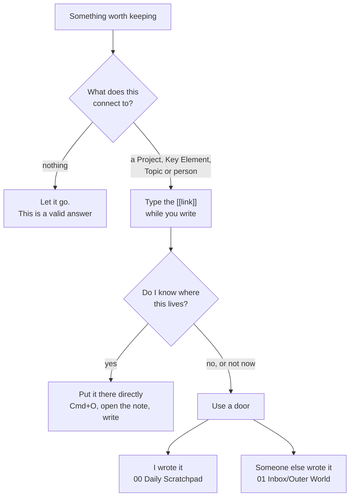
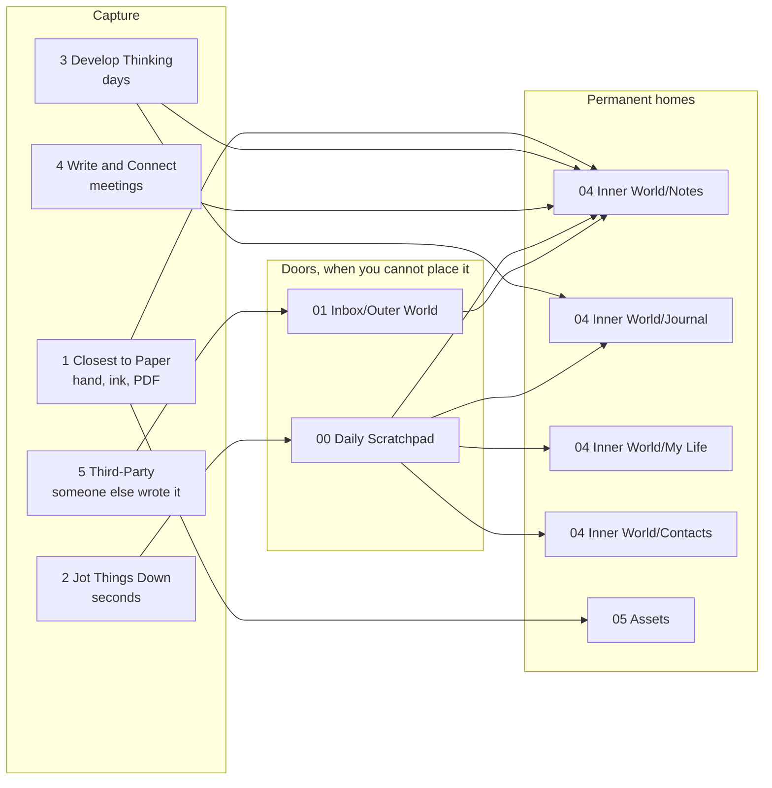
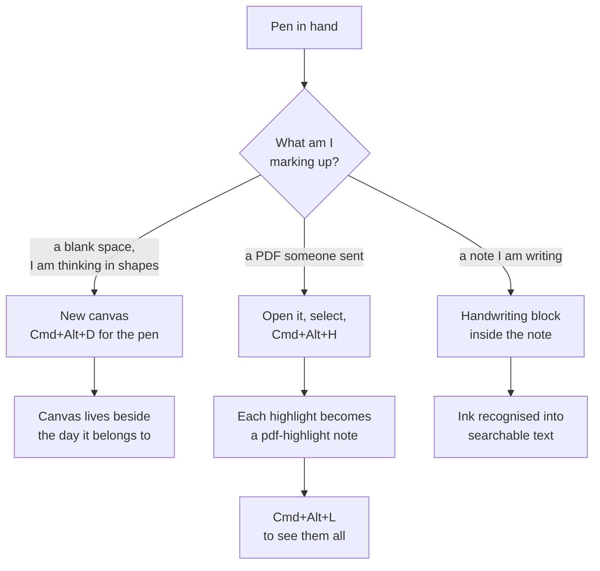
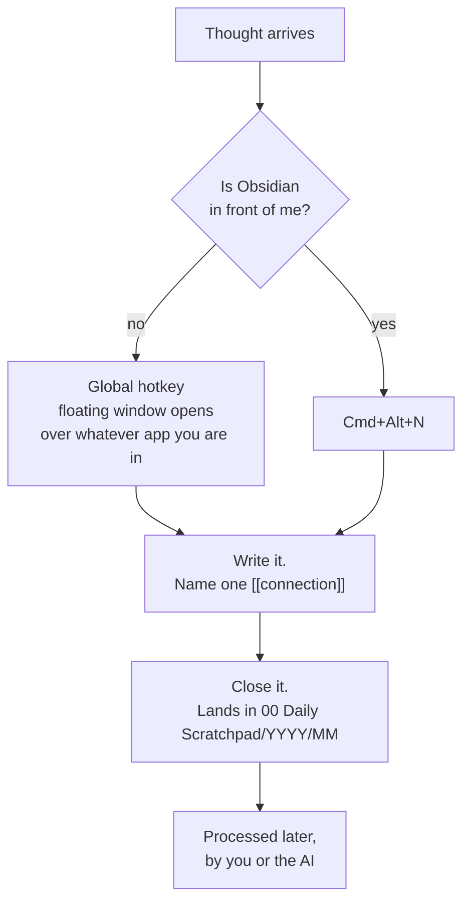
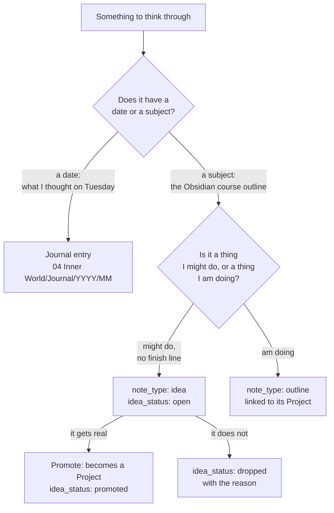
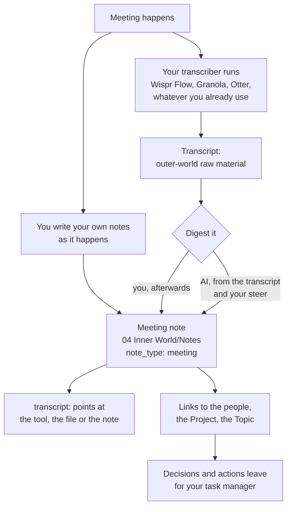
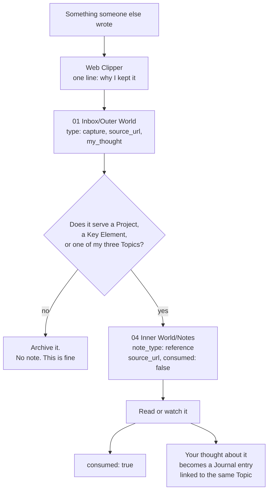
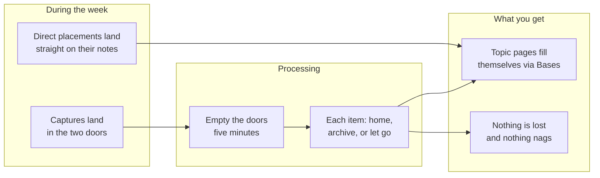

# GL-1010 The five capture workflows

[[GL-1007-capture-and-where-things-go|GL-1007]] answers "I have something,
where does it go?" This page answers the question underneath it: **which
of the five ways of taking a note am I doing right now, which key do I
press, and why does this vault ship the plugin that makes it work?**

ICOR names six note-taking workflows. Five of them are capture. The sixth,
The One that Goes Beyond, is about turning notes into tasks and projects,
which happens in your task manager, not here. This page covers the five.

## The one habit, before any of them

Everything below is mechanics. The habit is the thing that makes the
mechanics worth having, and it takes ten seconds:

> **Before you close any capture, name one thing it connects to.**

Type it as a `[[wikilink]]` while you write. Obsidian autocompletes it.
That link is what lets you find the note in six months, when you have
forgotten the words you used but still remember the project it belonged
to.

The reason this comes first: your brain does not have folders. It has
associations. A filing system asks you to pick one folder for a note that
genuinely belongs to four things, and then hides it in the one you picked.
A connection system lets you link all four.

**Orphan notes are dead notes.** If a capture connects to nothing, either
find the connection or let it go. Most of what crosses your screen is not
worth a note, and ICOR says so out loud.

Note the order. The connection question comes **before** the storage
question, and the storage question has a direct answer first and a door
second. An inbox is a backup plan. A vault where everything routes through
an inbox has an inbox nobody empties.

## The five workflows at a glance

| # | Workflow | You are doing this when | Tool | Lands in |
| --- | --- | --- | --- | --- |
| 1 | Closest to Paper | you want to write or draw by hand, or mark up a PDF | Handwriting, Canvases, PDF Annotation | the note, or `05 Assets/` |
| 2 | Jot Things Down | a thought arrives and you have seconds | Scratchpad plugin, or `Cmd+Alt+N` | `00 Daily Scratchpad/YYYY/MM/` |
| 3 | Develop Thinking | you are building something out over days | Outliner, Canvases, the Journal | `04 Inner World/Notes/` or `Journal/` |
| 4 | Write and Connect | you are in a meeting or on a call | your own transcriber, plus a `meeting` note | wherever your tool keeps the transcript, plus `04 Inner World/Notes/` |
| 5 | Third-Party Content | you found an article, video or PDF | Web Clipper, PDF Annotation | `01 Inbox/Outer World/` then `Notes/` |

Read the picture once and the shape is obvious: **capture is many, homes
are few, and the doors sit in between only for the cases where you cannot
go straight home.**

## Why this vault ships plugins at all

Obsidian out of the box does workflows 3 and 5 reasonably and the other
three badly. Each plugin exists to close one specific hole, and none of
them is decoration.

| Plugin | Closes | Without it |
| --- | --- | --- |
| Scratchpad | workflow 2 | quick capture means finding the Obsidian window first, which is the whole friction. **Ships today** |
| Handwriting | workflow 1 | ink lives in another app, and it is not searchable. **Not shipped: too buggy** |
| Canvases | workflows 1 and 3 | thinking visually means leaving the vault |
| PDF Annotation | workflows 1 and 5 | highlights live inside the PDF, where nothing can query them |
| Outliner | workflow 3 | a bullet does not move with its children, so restructuring a thought is retyping it |
| none, by design | workflow 4 | nothing. Your transcriber already does the hard part; the Scaffold owns the digest |
| Planner | the handover to workflow 6 | notes never become tasks |
| Scaffold Check | all of them | drift is invisible until something breaks |

**Shipping status, stated plainly.** Scratchpad, Canvases, PDF Annotation,
Outliner, Planner and Scaffold Check ship today, so **workflow 2 is complete
in the download**. Handwriting is built and **not shipped**: it is too buggy
to hand anyone, and shipping it would cost more trust than it buys, so
workflow 1 currently rests on Canvases and PDF Annotation, which is most of
it. **Workflow 4 has no plugin and never will**: you bring your own
transcriber, and its section says why that is the design rather than a gap.
Each section marks which is which.

## The keys

The Scaffold sets these up for you. They are in `.obsidian/hotkeys.json`
and you can change any of them under Settings, Hotkeys.

| Key | Does | Workflow |
| --- | --- | --- |
| `Cmd+Alt+N` | new quick capture, stamped `YYYYMMDDHHmm`, in today's folder | 2 |
| `Cmd+Alt+S` | today's daily note in the Daily Scratchpad | 2, 3 |
| `Cmd+Alt+T` | insert a template into the note you are in | all |
| `Cmd+Alt+P` | open the properties panel | all |
| `Cmd+Alt+H` | highlight the PDF selection | 1, 5 |
| `Cmd+Alt+L` | open the highlights sidebar | 5 |
| `Cmd+Alt+D` | pen tool on a canvas | 1 |
| `Cmd+O` | **open any note by name.** The direct-placement key | all |

`Cmd+O` is the one people overlook, and it is the most important key on
this page. It is how you put a phone number on a person's note in about
three seconds instead of capturing it and processing it twice.

## Workflow 1: Closest to Paper

**You are doing this when** you think better with a pen than a keyboard,
you are sketching a shape rather than writing a sentence, or you are
marking up something somebody else wrote.

**Ships today:** Canvases, PDF Annotation. **Not shipped:** Handwriting,
which is built and too buggy to hand anyone. Until it is good enough, ink
that starts on paper or on an iPad comes in as a scan or a photo through
workflow 5, and ink that starts on a canvas is already covered.

**Step by step, a PDF:**

1. Drop the PDF in `01 Inbox/Outer World/` or open it wherever it sits.
2. Select a passage. Press `Cmd+Alt+H`.
3. Add your own thought to the highlight. **This is the step people skip
   and it is the only step that matters.** A highlight without your thought
   is someone else's sentence; a highlight with your thought is your note.
4. `Cmd+Alt+L` opens the sidebar with every highlight in the document.
5. Each highlight is a real note with its own link, so a Topic page can
   gather highlights from twenty PDFs.

**Why a plugin rather than Obsidian's built-in PDF view:** the built-in
viewer shows highlights. It does not make them addressable. A highlight
you cannot link to is a highlight your Topic page cannot collect, which
means re-reading the PDF to find it, which is the thing you were trying to
avoid.

## Workflow 2: Jot Things Down

**You are doing this when** a thought arrives and you have seconds. In the
car, mid-meeting, walking. The test is not what the thought is about; it
is whether you have time to decide anything.

**Ships today:** the Scratchpad plugin, plus `Cmd+Alt+N` inside Obsidian.

**Step by step:**

1. Press the key. A blank note appears, named for the minute
   (`202609111432.md`). **You are not asked for a title**, because being
   asked for a title is exactly the friction this workflow exists to
   remove.
2. Write the thought in your own words. No structure, no headings.
3. Name one connection: `[[warhammer-40k]]`, `[[youtube-channel]]`,
   `[[caroline]]`. Ten seconds.
4. Close it. You are done. Nothing else is required of you today.

**The two shapes that live here:**

- **The daily note** `YYYY-MM-DD.md`, open all day at the desk. Write into
  it as the day runs. `Cmd+Alt+S`.
- **The quick capture** `YYYYMMDDHHmm.md`, one thought, any device.
  `Cmd+Alt+N`.

Which one? If the day's note is already in front of you, write there. If
it is not, press `Cmd+Alt+N`. That is the whole decision.

**The daily note is blank on purpose.** No template, no properties. A form
at the top of the page is a question you have to answer before you may
write, and that is the friction the door exists to remove.

**Why a plugin:** everything above works inside Obsidian already. The
Scratchpad's one job is the global hotkey, so the thought does not have to
survive the trip to the Obsidian window. That trip is where most captures
die, which is why this is the one plugin to turn on first.

## Workflow 3: Develop Thinking

**You are doing this when** you are building something out over days: an
outline, a strategy, an argument, a video script. You will come back to it
many times.

**Ships today:** Outliner, Canvases, the Journal.

**The fork people trip on: Journal or Note?** One question. **Does it have
a date as its identity, or a subject?** "What I thought on Tuesday" is a
Journal entry and is never rewritten. "The outline of the Obsidian course"
is a Note; it has a subject, it gets edited for months, and the date it
started does not matter.

**The second fork, new in this version: idea or outline?** An `idea` is a
thing you might do. It has no finish line, so it is not a Project, and it
is not one of your three quarterly Topics either. A video idea sits as
`note_type: idea` with `idea_status: open`, collecting thoughts, until it
becomes a Project or you drop it. Recording why you dropped it is the most
valuable line on the page, because it stops you having the same idea again
next year.

**Step by step, the video idea:**

1. `Cmd+O`, type the idea's name, Obsidian offers to create it.
2. `Cmd+Alt+T`, pick `idea`. The frontmatter arrives filled in.
3. Anchor it: `key_elements: ["[[youtube-channel]]"]`.
4. Add thoughts whenever they arrive, for as long as it stays interesting.
5. When it gets real, set `idea_status: promoted`, create the Project, and
   link them.

**Why the Outliner plugin:** in plain Obsidian, indenting a bullet leaves
its children behind. Restructuring a thought becomes retyping it, so you
stop restructuring, so the outline stops improving. The plugin makes a
bullet move with everything under it. That is the entire feature and it is
the difference between an outline you edit and an outline you abandon.

## Workflow 4: Write and Connect Information

**You are doing this when** you are in a meeting, on a call, at an event.
Two different things are being produced at once and they must not be stored
in the same place: **what was said**, and **what you concluded**.

**Ships today:** nothing, and that is the design.

**The Scaffold does not record meetings and will not.** You already have a
transcriber, or your company does: Wispr Flow, Granola, Otter, Fireflies,
the one built into your call software. Building a worse one inside Obsidian
would be a second-rate copy of a solved problem, and it would tie your
meeting notes to our plugin. Use the tool you already trust.

What the Scaffold owns is the part no transcriber does: **turning an hour
of what was said into the few lines of what you now think.**

**The split, stated once.** The transcript is a machine record of what was
said. You did not write it, so it is outer-world material, and it lives
wherever your tool keeps it or in `05 Assets/` if you export it. The
meeting note is what you took from it, so it is yours, and it lives in
`04 Inner World/Notes/` as `note_type: meeting`. Storing them together
means re-reading an hour of transcript to find the one decision.

### Three ways in, and you will use all three

**1. You write it live.** The highest-value notes are the ones only you can
take: what you noticed, what you did not say out loud, what this means for
a project nobody in the room mentioned. Open the meeting note before the
call and write into it. A transcript never contains these.

**2. AI reads the transcript and extracts, with your steer.** Afterwards,
point the AI at the transcript and tell it what you are looking for: the
decisions, the commitments you made, the objections you did not answer, the
three things relevant to a specific Project. The steer is the whole trick.
"Summarize this meeting" produces a summary you will never read;
"what did I commit to, and what did I dodge" produces two lines you will
act on.

**3. AI enriches the notes you already wrote.** The most useful of the
three. You have five scrappy lines; the AI has the full transcript. Ask it
to fill in what your lines refer to, add what you missed, and flag where
the transcript contradicts what you remember. Your words stay; the context
gets added around them.

### Step by step

1. **Before:** create the meeting note. `Cmd+O`, name it, `Cmd+Alt+T`,
   pick `note`, set `note_type: meeting`. Link the people and the Project.
2. **During:** write your own notes. Your transcriber runs separately and
   you do not think about it.
3. **After:** put the transcript where you will find it. Either leave it in
   the tool and paste the link into `transcript:`, export it into
   `05 Assets/` and wikilink it, or drop it in `01 Inbox/Outer World/` to
   be processed like any other outer-world capture.
4. Set `transcribed_by` to the tool's name, in the words you would say out
   loud. In two years this is how you tell a transcript you trust from one
   you do not.
5. **Digest:** run one of the three ways above. If an AI wrote into the
   note, record which model in `ai_summary`.
6. Every action item leaves the vault for your task manager. That is
   workflow 6 and it is not this vault's job.

### Why there is no plugin here

Every other workflow on this page has a plugin because Obsidian genuinely
cannot do the thing. Workflow 4 is the opposite case: the hard part is
already solved by tools that do nothing else, and the part that is not
solved is judgement, which is not a plugin. A Scaffold that recorded audio
would be competing on the one axis where it has no advantage and giving up
the one where it does.

**Consent is yours, not ours.** The Scaffold never starts a recording, so
it never asks for consent on your behalf. Whatever your transcriber asks,
and whatever the law where you and the other people are, is between you and
them.

## Workflow 5: Notes on Third-Party Content

**You are doing this when** somebody else wrote it: an article, a video, a
paper, a PDF, a post.

**Ships today:** the Obsidian Web Clipper with the template this Scaffold
provides, plus PDF Annotation.

**Step by step:**

1. Install the Obsidian Web Clipper extension and import the template at
   `06 AI Team/AI Team Knowledge/Templates/web-clipper-outer-world.json`.
2. Clip. **Write one line in the `my_thought` box before you save.** One
   sentence is enough.
3. It lands in `01 Inbox/Outer World/` already shaped: `type: capture`,
   `source_url`, `captured`, `my_thought`.
4. Processing turns it into a note in `04 Inner World/Notes/` with
   `note_type: reference`, its `source_url`, and `consumed: false`.
5. When you actually read it, flip `consumed: true`. Your reaction to it is
   a separate Journal entry, linked to the same Topic.

**Why `my_thought` is not optional.** A clip without your thought can only
ever become a reference: a thing you saved. A clip with your thought can
become a journal entry, an argument, a video. The line you write in the
popup is the difference between a bookmark and a note, and it costs five
seconds at the only moment you will ever remember why you kept it.

**Where outer material actually lives.** Not in a room of its own.
`01 Inbox/Outer World/` is named for what **arrives** there, not for where
it stays. Once you have taken the insight out and added your thought, it
has become part of what you know, so it lives in `04 Inner World/Notes/`
with its source recorded in a property. To see everything that came from
outside, open `Notes.base` and filter `note_type` to `reference`. That view
is your outer-world library, and it is a view rather than a folder because
the same note is usually several things at once.

## The reading queue, and why it does not nag

A `reference` note carries `consumed: false` until you have actually read
or watched it. The Topic page lists what is still waiting.

That is ICOR's Bucket: it supports action when you turn to the subject, it
does not chase you. A reading list that sends notifications becomes a
source of guilt; a reading list that sits on the Topic page becomes a
resource you reach for when you are already thinking about that Topic.

## Putting it together: one week

**The five-minute rule is the health check.** If emptying your doors takes
longer than five minutes, you are capturing things that could have been
placed directly, or capturing things that failed the Capturing Beast and
should have been let go. The fix is upstream, at capture, not downstream in
a longer processing session.

## The Capturing Beast, as a filter you run in one second

Before anything is kept, three questions in this order:

1. Does it serve a **current Project**?
2. Does it touch a **Key Element** of your life?
3. Does it belong to one of your **Topics**, of which you run three at a
   time?

Yes to any one: it gets a home and a link to that thing. No to all three:
it goes nowhere, and that is allowed. Most of what crosses your screen is
not worth a note.

This is the same test as "name one thing it connects to" at the top of this
page. The link **is** the filter. If you cannot name the connection, the
Beast has already answered.

## What this page does not cover

- **Workflow 6, The One that Goes Beyond**: turning notes into tasks and
  projects. Actions live in your task manager, not in this vault; the
  Planner plugin is the bridge.
- **Processing** in detail: [[SOP-1001-process-the-daily-scratchpad|SOP-1001]]
  and [[SOP-1002-process-an-inbox-capture|SOP-1002]].
- **Which home for which kind of note**: [[GL-1007-capture-and-where-things-go|GL-1007]].
- **What each property means**: [[GL-1002-frontmatter-conventions|GL-1002]].
