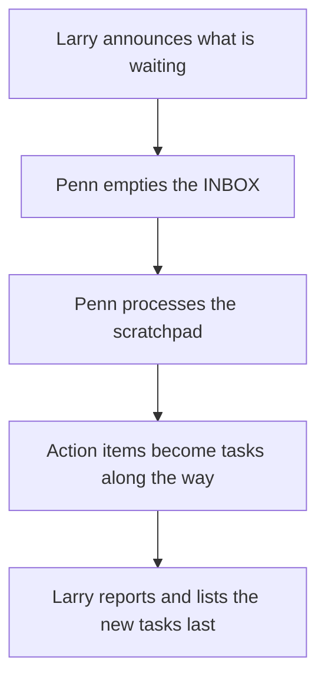

# WS-001 Daily processing run

Triggered by "process my day" / "process everything" or a user-defined
automation. One pass over both capture doors.

1. Larry announces what is waiting: unprocessed scratchpad sections,
   INBOX item count.
2. Penn runs [[SOP-002-process-an-inbox-capture|SOP-002]] (INBOX captures) until the active INBOX is empty.
3. Penn runs [[SOP-001-process-the-daily-scratchpad|SOP-001]] (today's scratchpad, plus any earlier unprocessed
   days the user confirms).
4. Larry reports: what was created, what was updated, what needs the
   user (as explicit questions, not buried in prose).
5. Detected action items became tasks ([[SOP-008-track-work-across-sessions|SOP-008]]) along the way; Larry
   lists them last.
