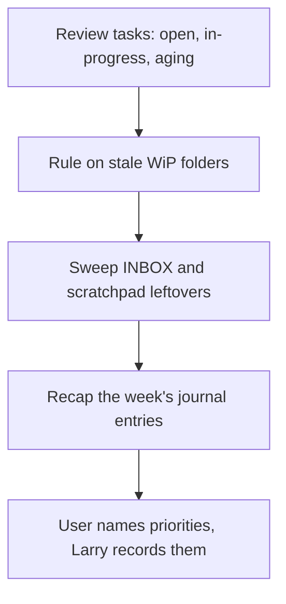

# WS-002 Weekly review

Triggered by "weekly review". Fifteen minutes, four looks back and one
forward.

1. Tasks: everything in open/ and in-progress/, aging flagged.
2. WiP: folders untouched for 30+ days; per folder the user rules
   finish, archive, or keep.
3. INBOX and Scratchpads: any unprocessed leftovers from the week.
4. Journal: the week's entries as a two-minute narrated recap
   (headlines only, links provided).
5. Forward: the user names the week's priorities; Larry records them in
   the session log and creates or reprioritizes tasks.
