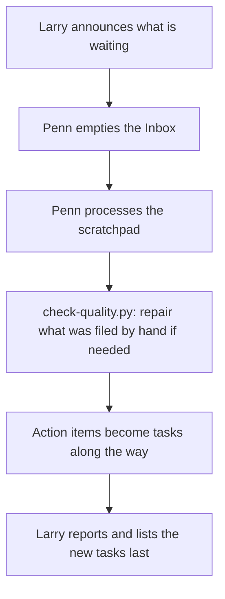

# WS-1001 Daily processing run

Triggered by "process my day" / "process everything" or a user-defined
automation. One pass over both capture doors.

1. Larry announces what is waiting: unprocessed scratchpad sections,
   Inbox item count.
2. Penn runs [[SOP-1002-process-an-inbox-capture|SOP-1002]] (Inbox captures) until the active Inbox is empty.
3. Penn runs [[SOP-1001-process-the-daily-scratchpad|SOP-1001]] (today's scratchpad, plus any earlier unprocessed
   days the user confirms).
4. [SCRIPT] After the two doors, `Scripts/check-quality.py --write`.
   When `.icor-for-life/scripts/quality.json` says `attention` or
   `broken`, Penn runs
   [[SOP-1014-check-and-repair-what-was-filed-by-hand|SOP-1014]];
   otherwise Larry reports `health: ok` in one line.
5. Larry reports: what was created, what was updated, what needs the
   user (as explicit questions, not buried in prose).
6. Detected action items became tasks ([[SOP-1008-track-work-across-sessions|SOP-1008]]) along the way; Larry
   lists them last.
