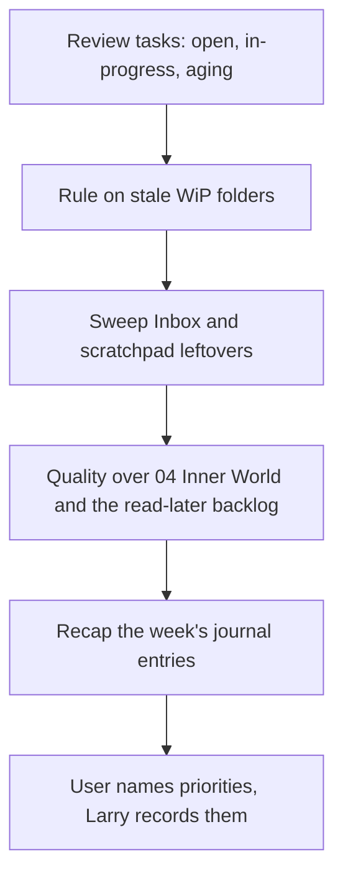

# WS-1002 Weekly review

Triggered by "weekly review". Fifteen minutes, five looks back and one
forward.

1. Tasks: everything in open/ and in-progress/, aging flagged.
2. WiP: folders untouched for 30+ days; per folder the user rules
   finish, archive, or keep.
   Steps 1 and 2 come from one run of `Scripts/checkpoint.py --window 30`,
   the same script `/checkpoint` uses at session grain
   ([[WS-1005-checkpoint|WS-1005]]).
3. Inbox and Scratchpads: any unprocessed leftovers from the week.
4. Quality over `04 Inner World`: [SCRIPT] `Scripts/check-quality.py
   --write`. Health `attention` or `broken` runs
   [[SOP-1014-check-and-repair-what-was-filed-by-hand|SOP-1014]] for the
   week's notes. The read-later backlog (`unconsumed_references`) is the
   weekly question: per reference, one line, read it this week, mark it
   consumed, or let it wait; the user answers, the team flips the field.
5. Journal: the week's entries as a two-minute narrated recap
   (headlines only, links provided).
6. Forward: the user names the week's priorities; Larry records them in
   the session log and creates or reprioritizes tasks.
